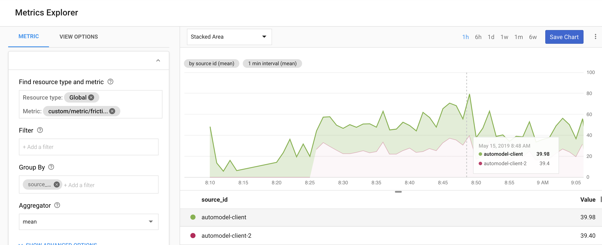
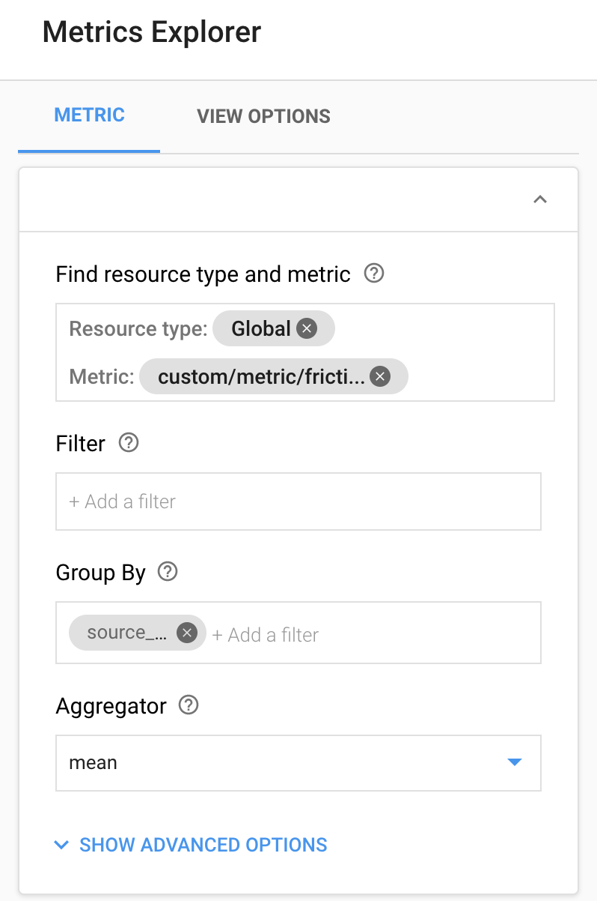
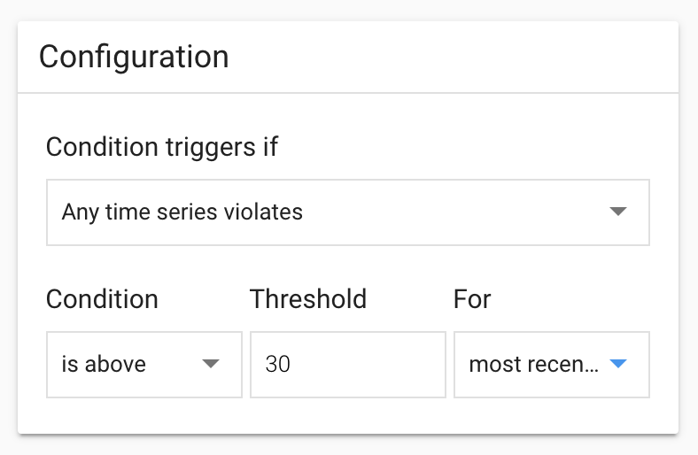
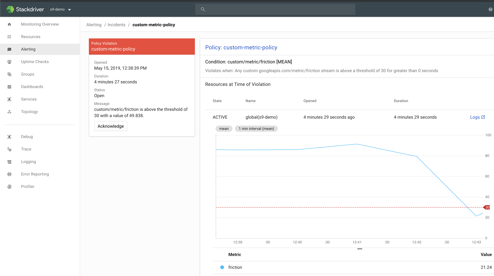

# custommetrics

This demo illustrates how to use a generic Cloud Function to trigger on already existing PubSub topic, extract data from its payload, and publish it to Google Stackdriver as a custom metric without altering your original data pipeline.

## Context

If you have done any distributed development on GCP you've probably used PubSub to connect two or more data/event processing components (e.g. IoT Gateway to BigQuery or GCE-based batch process to Dataflow processing etc.). When I build these kind of integrations I often find myself wishing I could "take a pick" at one of the metrics in the data flowing through the system.

```json
{
  "source_id":"device-1",
  "event_id":"63404713-76c8-412b-a8fc-49f35409a977",
  "event_ts":"2019-05-14T05:48:13.132652Z",
  "metric": {
    "label":"friction",
    "value":0.2789,
  },
}
```

Assuming for example that your data published to PubSub topic has the above shape, in this demo I will illustrate how you can easily monitor the deviation of `friction` per each `device` over time without the need to manage additional infrastructure.



Additionally, I will show you how you can create monitoring policy to alert you when the monitored metric falls outside of the pre-configured range.

> Note, this will only work on JSON PubSub payloads

## Configuration

Assuming the above JSON payload shape on your PubSub topic, there are few variables we need to define first is the name of the PubSub topic on which you want to trigger

```shell
TOPIC="iotevents"
```

We also need to define the Stackdriver metric type (`custom.googleapis.com/metric/*`) where the last part is the type of metric we will be tracking (e.g. `custom.googleapis.com/metric/friction` for friction) and the payload selector paths for `SRC_ID_PATH`, `VALUE_PATH`, `TIME_PATH`.

```shell
FVARS="METRIC_TYPE=custom.googleapis.com/metric/friction"
FVARS+=",SRC_ID_PATH=source_id"
FVARS+=",VALUE_PATH=cpu_used"
FVARS+=",TIME_PATH=event_ts"
```

Few things to keep in mind:

* The value of `SRC_ID_PATH` selector must uniquely identity of the source of this event across all events
* The value of `VALUE_PATH` select must be numeric (int or float)
* `TIME_PATH` is optional. If not set it will be set to event processing time. But if set, it must be in RFC3339 format

## Deployment

Once you have these variables defined, you can deploy the Cloud Function

```shell
gcloud functions deploy custommetrics \
  --entry-point ProcessorMetric \
  --set-env-vars=$FVARS \
  --memory 256MB \
  --region us-central1 \
  --runtime go111 \
  --trigger-topic $TOPIC \
  --timeout 540s
```

If everything goes well you will see a confirmation

```shell
$: bin/deploy
Deploying function (may take a while - up to 2 minutes)...done.
...
status: ACTIVE
versionId: '3'
```

## Monitoring

In Stackdriver now you can use Metric Explorer to build a time-series chart of the published data. First, use the  resource type and metric finder to paste your metric type. Using the above deployment as an example that would be `custom.googleapis.com/metric/friction`.



Now you can use the `Group By` to display the time series per `source_id` and optionally specify the Aggregator in case you want to display `mean` for more volatile metrics.

> More details on Stackdriver metrics selection [here](https://cloud.google.com/monitoring/charts/metrics-selector)

> Also, make sure to consider the [Stackdriver Monitoring limits on custom metrics](https://cloud.google.com/monitoring/quotas) before implementing this. Specifically, the fact that the rate at which data can be written to a single time series is 1 point per min.

## Alerts

Once you have custom metric monitored in stack driver you can easily create an alert policy. Many options there with regards to the duration, single or multiple sources, and percentages vs single values.



Once configured though, when the monitored metrics violates that policy you can get notifications about an incident



Obviously this approach is meant to replace a proper monitoring solution. Still, I hope you found it helpful.

## Disclaimer

This is my personal project and it does not represent my employer. I take no responsibility for issues caused by this code. I do my best to ensure that everything works, but if something goes wrong, my apologies is all you will get.
